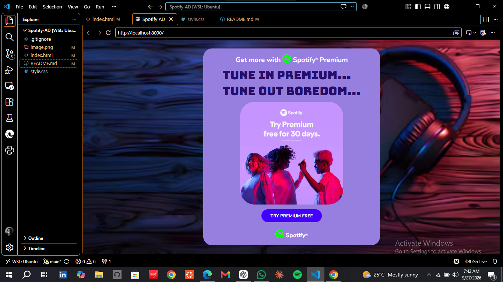
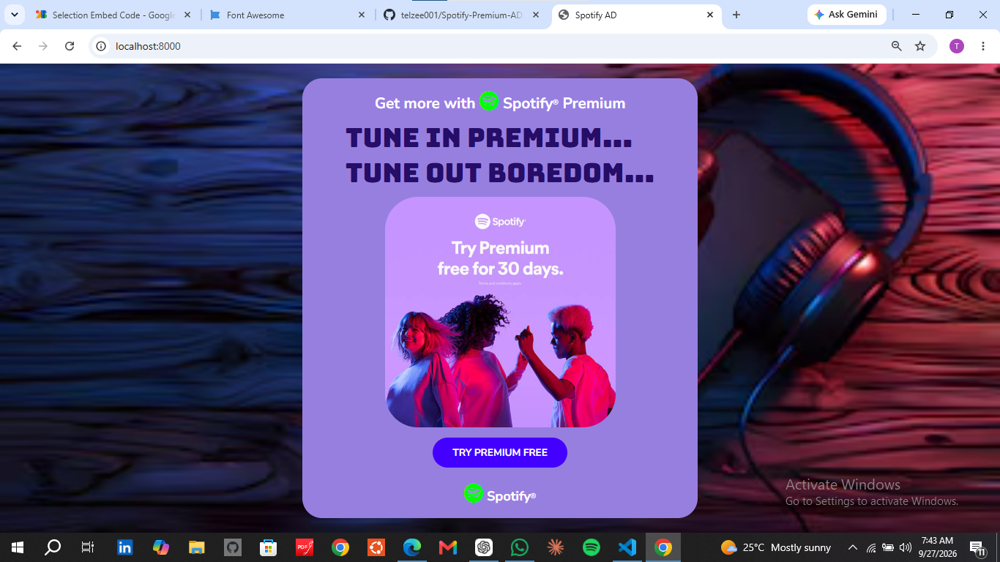

# Spotify Premium Ad

A responsive Spotify-inspired promotional landing interface built with HTML and CSS.

The project recreates the visual structure of a premium music advertisement with a strong promotional hierarchy, responsive layout, branded typography, interactive CTA states, and adaptive media presentation.

## Features

- Responsive promotional card layout
- Desktop and mobile viewport support
- Adaptive promotional imagery
- Custom Google Fonts
- Font Awesome brand icons
- Responsive typography
- CTA hover interaction
- Keyboard-accessible focus state
- Full-screen promotional background
- Flexible layout built with CSS Flexbox

## Built With

- HTML5
- CSS3
- Flexbox
- Media Queries
- Google Fonts
- Font Awesome

## Responsive Design

The interface uses fluid sizing and maximum-width constraints to preserve the desktop composition while adapting to smaller screens.

Promotional media scales within its container without distortion, while typography adjusts at smaller breakpoints to maintain readability.

The layout has been tested across desktop, tablet, mobile, and narrow mobile viewports.

## Project Structure

    spotify-AD/
    ├── index.html
    ├── style.css
    ├── image.png
    └── README.md

## Run Locally

Clone the repository and open `index.html` in your browser.

No build tools or dependencies are required.

## Status

Completed.

## Disclaimer

This project is an independent frontend recreation created for portfolio and development purposes. It is not affiliated with or endorsed by Spotify. Spotify names, branding, and trademarks belong to their respective owners.

